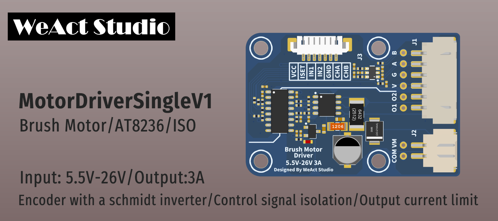

* [中文版本](./README-zh.md)
# WeActStudio.MotorDriverSingleV1

* Input voltage: 5.5V-26V
* Output current: 3A (peak 3.3A)
* Drive signal power supply is independent and isolated from motor drive power supply
* Support AB encoder and use Schmidt invertor to shape encoder signal

## Module signal definition
|Control side signal name|Instructions|Motor side signal name|Instructions|
| :--:|:--:|:--:|:--:|
|VCC|Control signal power supply,input range 3.3V-5.25V|VM|Motor power supply, input range 5.5V-26V|
|ISET|Output current limit,100% duty cycle is 3.3A|COM|Motor power supply ground|
|IN1|O1 output control,support maximum 100khz|O1|Drive output 1|
|IN2|O2 output control,support maximum 100khz|O2|Drive output 2|
|GND|Control signal power supply ground|V/G|V,positive pole of encoder power supply,connected with VCC;G,the negative terminal of the encoder power supply,connected with GND|
|CHA|Encoder phase A output,maximum voltage following VCC|A|Encoder phase A input|
|CHB|Encoder phase B output,maximum voltage following VCC|B|Encoder phase B input|

## Announcements
1. Separate motor drive lines O1 and O2. If one of the two lines is close to encoder power supply V, it will interfere with encoder feedback signal and result in motor jitter
> Solution, use rolling tape to tie up the motor drive line to prevent it from separating, it can be solved
2. tbd ...

## Dir instructions
|Dir Name|Instructions|
| :--:|:--:|
|Doc|DataSheet|
|HDK|Hardware Development Kit|
|Examples|Software Examples|

```
/*---------------------------------------
- WeAct Studio Official Link
- taobao: weactstudio.taobao.com
- aliexpress: weactstudio.aliexpress.com
- github: github.com/WeActTC
- gitee: gitee.com/WeAct-TC
- blog: www.weact-tc.cn
---------------------------------------*/
```