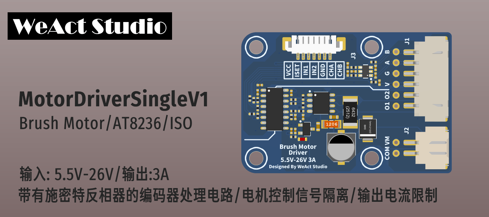

* [English version](./README.md)
# WeActStudio.MotorDriverSingleV1

* 输入电压：5.5V-26V
* 输出电流：3A (峰值3.3A)
* 驱动信号电源与电机驱动电源独立且隔离
* 支持AB编码器，并使用施密特反相器对编码器信号进行整形

## 模块信号定义
|控制侧信号名称|说明|电机侧信号名称|说明|
| :--:|:--:|:--:|:--:|
|VCC|控制信号电源，输入范围3.3V-5.25V|VM|电机电源,输入范围5.5V-26V|
|ISET|输出电流限制，100%占空比为3.3A|COM|电机电源地|
|IN1|O1输出控制，支持最大100khz|O1|驱动输出1|
|IN2|O2输出控制，支持最大100khz|O2|驱动输出2|
|GND|控制信号电源地|V/G|V，编码器电源正，与VCC相连；G，编码器电源负，与GND相连|
|CHA|编码器A相输出，最大电压跟随VCC|A|编码器A相输入|
|CHB|编码器B相输出，最大电压跟随VCC|B|编码器B相输入|

## 注意事项
1. 将电机驱动线O1,O2分开，当中一根线靠近编码器电源V，会干扰编码器反馈信号，出现电机抖动
> 解决方法，使用轧带将电机驱动线扎起，防止其分开，即可解决。
2. 待补充

## 目录说明
|目录名称|内容|
| :--:|:--:|
|Doc| 数据手册|
|HDK| 硬件开发资料|
|Examples|软件例程|

```
/*---------------------------------------
- WeAct Studio Official Link
- taobao: weactstudio.taobao.com
- aliexpress: weactstudio.aliexpress.com
- github: github.com/WeActTC
- gitee: gitee.com/WeAct-TC
- blog: www.weact-tc.cn
---------------------------------------*/
```